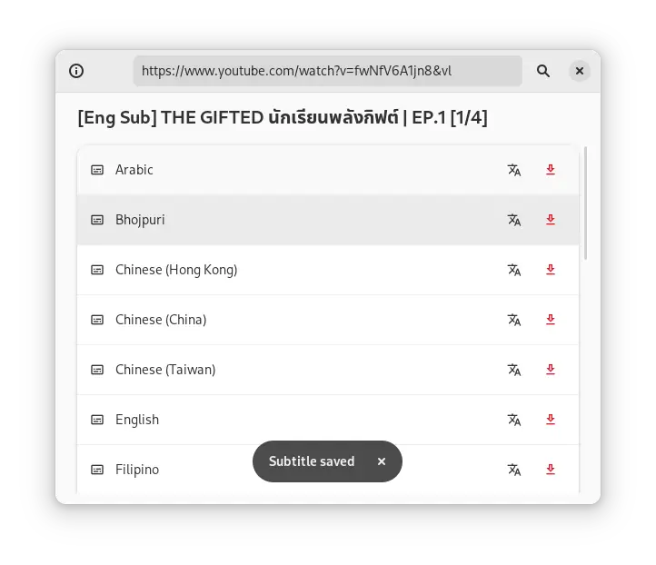

  <h1>USub</h1>
  A GTK4 app to download subtitles for YouTube videos using<a href="https://github.com/jdepoix/youtube-transcript-api"> YouTube transcript api</a>

## Building:

- **Requirements**

 <i>pip install youtube_transcript_api</i>

- **Build**

 <i>meson build --prefix=/usr</i>

 <i>cd build</i>

 <i>sudo ninja install</i>
